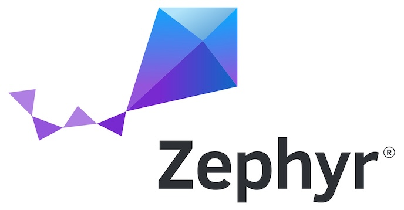

> [!IMPORTANT]  
> This core is in **BETA**. 🧪  
> Features may change, and bugs may be present. Use for testing only and provide feedback to help us improve.
>
> [](https://github.com/arduino/ArduinoCore-zephyr/actions/workflows/package_core.yml)

# 🚧 Arduino Core for Zephyr

This repository contains the official implementation of **Arduino Core** for Zephyr RTOS based board.

## 🧐 What is Zephyr? 

[Zephyr RTOS](https://zephyrproject.org/) is an open-source, real-time operating system designed for low-power, resource-constrained devices. It's modular, scalable, and supports multiple architectures.



## ⚙️ Installation

Install the core and its toolchains via Board Manager:
* Download and install the latest [Arduino IDE](https://www.arduino.cc/en/software) (only versions `2.x.x` are supported).
* Open the *'Settings / Preferences'* window.
* Open the *'Boards Manager'* from the side menu and search for *'Zephyr'*.
  * If it doesn’t appear, add the following URL to the *'Additional Boards Manager URLs'* field: `https://downloads.arduino.cc/packages/package_zephyr_index.json` (if you have multiple URLs, separate them with a comma).
* Install the `Arduino Zephyr Boards` platform.

Alternatively, to install the core using the command line, run the following command with the Arduino CLI:

```bash
arduino-cli core install arduino:zephyr --additional-urls https://downloads.arduino.cc/packages/package_zephyr_index.json
```

## 🏗️ First Use

To get started with your board:
* Put the board in bootloader mode by double-clicking the RESET button.
* Run the `Burn Bootloader` option from the IDE/CLI.
  * Note that due to limitations in the Arduino IDE, you may need to select any programmer from the `Programmers` menu.
* Once the bootloader is installed, you can load your first sketch by placing the board into bootloader mode again.

> [!NOTE]  
> After the initial setup, future sketches will be loaded automatically without needing to reset the board.

## 🔧 Troubleshooting

### Common Issues

#### **Q: My Sketch doesn't start (Serial doesn't appear)**
**A:** Connect a USB-to-UART adapter to the default UART (eg. TX0/RX0 on Giga, TX/RX on Nano) and read the error message (with the sketch compiled in `Default` mode). If you don't own a USB-to-UART adapter, compile the sketch in `Debug` mode; this will force the shell to wait until you open the Serial Monitor. Then, run `sketch` command and *probably* you'll be able to read the error (if generated by `llext`). For OS crashes, the USB-to-UART adapter is the only way to collect the crash.

---

#### **Q: I did it and I get the error: `<err> llext: Undefined symbol with no entry in symbol table ...`**
**A:** This means you are trying to use a Zephyr function which has not yet been exported. Open `llext_exports.c`, add the function you need and recompile/upload the loader.

---

#### **Q: I want to use a Zephyr subsystem which is not compiled in**
**A:** Open the `.conf` file for your board, add the required `CONFIG_`, recompile/upload the loader.

---

#### **Q: I get an OS crash, like `<err> os: ***** USAGE FAULT *****`**
**A:** This is usually due to a buffer overflow or coding error in the user's own code. However, since the project is still in beta 🧪, a [good bug report](#-bug-reporting) could help identify any issues in our code.

---

#### **Q: I get an out of memory error**
**A:** Since collecting bug reports is very important at this time, we are keeping Zephyr's shell enabled to allow loading a full sketch (which requires a large stack). Adjust your board's `.conf` file to reduce the stack size if your platform doesn't have enough RAM.

## 📚 Libraries

### Included with the core: ###

### Separately supplied: ###
- **ArduinoBLE**: This library is enabled only for the Arduino Nano 33 BLE. Please use [this branch](https://github.com/facchinm/ArduinoBLE/tree/zephyr_hci) to test it.

## 🧢 Under the hood

Unlike traditional Arduino implementations, where the final output is a standalone binary loaded by a bootloader, this core generates a freestanding `elf` file. This file is dynamically loaded by a precompiled Zephyr firmware, referred to as the `loader`.

The `loader` is responsible for managing the interaction between your sketches and the underlying Zephyr system. After the initial bootloader installation, the `loader` takes over the sketch loading process automatically.

To ensure flexibility, the `loader` project is designed to be generic. Any necessary modifications for specific boards should be made in the corresponding "DTS overlay" or a special "fixup" file, using appropriate guards to maintain compatibility.

The behavior of the `loader` can be adjusted through the `Mode` menu of the IDE:
- `Standard`: The sketch is loaded automatically.
- `Debug`: The user must type `sketch` in Zephyr's shell, which is accessible via the default Serial.

The most important components of this project are:

* [Zephyr based loader](/loader)
* [LLEXT](https://docs.zephyrproject.org/latest/services/llext/index.html)
* [Actual core](/cores/arduino) with [variants](/variants) and the usual [platform](/platform.txt) and [boards](/boards) files
* [ArduinoCore-API](https://github.com/arduino/ArduinoCore-API)
* [zephyr-sketch-tool](/extra/zephyr-sketch-tool)

## 🏃 Shortcut: using the Core in Arduino IDE/CLI without installing Zephyr

> [!TIP]
>
> If you are only interested in developing features in the [core](/cores/arduino)
> or [libraries](/libraries), and do not want to set up a full Zephyr build
> environment, you can use the [`sync-zephyr-artifacts`](/extra/sync-zephyr-artifacts) 
> utility to download a pre-built version of the files needed to compile
> sketches and flash the loader.
>
> To do so, after cloning this repo, compile the `sync-zephyr-artifacts`
> utility via `go build` and run it as `sync-zephyr-artifacts .` to retrieve
> the precompiled files for the current revision of the core. 
>
> Next, follow the instructions in [Using the Core in Arduino IDE/CLI](#using-the-core-in-arduino-idecli).
> Remember to [update the loader on your board](#flash-the-loader) as well.

## 🛠️ Setup a Zephyr build environment

> [!WARNING]  
> If upgrading from release ≤ 0.3.1 to > 0.3.1: delete your local copy and clone the repository again following the installation instructions.

In this section, we’ll guide you through setting up your environment to work on and update the Zephyr core.

Shell scripts are available to simplify the installation process (Windows is not supported at the moment 😔).

### Clone the repository
```bash
mkdir my_new_zephyr_folder && cd my_new_zephyr_folder
git clone https://github.com/arduino/ArduinoCore-zephyr
```
### Pre-requirements
Before running the installation script, ensure that Python, `pip` and `venv` are installed on your system. The script will automatically install `west` and manage the necessary dependencies.

#### On Ubuntu or similar apt-based distros
```bash
sudo apt install python3-pip python3-setuptools python3-venv build-essential git cmake ninja-build zstd jq
```
#### On macOS
Make sure you have Homebrew installed. Then run:

```bash
# Install Xcode Command Line Tools (needed for compilers and make)
xcode-select --install

# Install required tools and libraries
brew install python cmake ninja zstd jq git
```
Note: Homebrew’s Python installation already includes `pip`, `setuptools` and `venv`.

### Run the ```bootstrap``` script
```bash
cd ArduinoCore-zephyr
./extra/bootstrap.sh
```

This will take care of installing `west`, the Zephyr build tool. It will then
download all packages required for a Zephyr build in addition to the toolchains
in the Zephyr SDK.

> [!NOTE]
> This core is validated with version v0.17.0 of the SDK. Compatibility with later versions has not been tested yet.

## 🛠️ Regenerate the compiled core files

### Build the Loader

The loader is compiled for each board by running the `./extra/build.sh` script.
The target can be specified either with the Arduino board name (as defined in
boards.txt), or with the Zephyr board name and any additional arguments that
may be required by the Zephyr build system.

For example, to build for the Arduino Portenta H7, you can use either the
Arduino name:
```bash
./extra/build.sh portentah7
```

or the Zephyr board target:

```bash
./extra/build.sh arduino_portenta_h7//m7
```

The firmwares will be copied to the [firmware](/firmware) folder, and the
associated variant will be updated.

### Flash the Loader

To flash the loader, run:

```bash
west flash -d build/<variant-name>
```

The `<variant-name>` appears in the build output when you run the build script. For example:

```bash
% ./extra/build.sh portentah7

Build target: arduino_portenta_h7@1.0.0//m7
Build variant: arduino_portenta_h7_stm32h747xx_m7
-- west build: generating a build system
...
```

In this case, you would flash with:
```bash
west flash -d build/arduino_portenta_h7_stm32h747xx_m7
```

This can also be performed via the "Burn bootloader" action in the IDE if the core is properly installed, as detailed below.

### Using the Core in Arduino IDE/CLI

After running the `bootstrap.sh` script, you can symlink the core to `$sketchbook/hardware/arduino-git/zephyr`. Once linked, it will appear in the IDE/CLI, and the board's Fully Qualified Board Name (FQBN) will be formatted as `arduino-git:zephyr:name_from_boards_txt`.

Remember to also install and/or update the officially published core in the IDE Board Manager to get the latest tools and dependencies. 
[⚙️ Installation](#️-installation).

## 🚀 Adding a new target

> [!TIP]
>
> While Zephyr supports a lot of different hardware targets, only the few
> currently used by the Arduino core are installed by default. To add the
> support for every Zephyr target to your workspace, run the following
> commands:
>
> ```bash
> . venv/bin/activate
> west config -d manifest.project-filter
> west sdk install --version 0.17.0
> west update
> ```

To add a new board that is already supported by mainline Zephyr with the target `$your_board`, follow these steps:

* Get the variant name from your board by running `extra/get_variant_name.sh $your_board`.
* Create a folder in the [`variants/`](/variants) directory with the same name as the variant for your new board.
* Create the DTS `<variant>.overlay` and Kconfig `<variant>.conf` files in that directory.

  The overlay must include:
  * A flash partition called `user_sketch`, typically located near the end of the flash.
  * A `zephyr,user` section containing the description for GPIOs, Analog, UART, SPI and I2C devices. Feel free to leave some fields empty in case Zephyr support is missing. This will result in some APIs not being available at runtime (eg. `analogWrite` if PWM section is empty).

  The Kconfig file must include any board-specific options required by this target.
* Build the Loader: run `./extra/build.sh $your_board` (with any additional arguments as required) and start debugging the errors. :grin:
* Update the `boards.txt`: add an entry for your board, manually filling the required fields.

  Make sure to set:
   * `build.zephyr_target` and `build.zephyr_args` to the arguments used in the `build.sh` call;
   * `build.zephyr_hals` to the (space-separated list of) HAL modules required by the board;
   * `build.variant` to the variant name identified above.
* Implement touch support: if your board supports the "1200bps touch" method, implement `_on_1200_bps` in a file located inside the variant folder of your board.

## 🐛 Bug Reporting

To report a bug, open the [issues](/../../issues) and follow the instructions. Any issue opened without the needed information will be discarded.

## 🙌 Contributions

Contributions are always welcome. The preferred way to receive code contribution is by submitting a [Pull request](/../../pulls).

> [!WARNING] 
> At this stage of development, we only accept Pull requests for bug fixes and features. We do **not** accept support for new targets.

## 📌 Upcoming features

- [ ] USB: switch to `USB_DEVICE_STACK_NEXT` to support PluggableUSB
- [ ] Relocate RODATA in flash to accommodate sketches with large assets
- [ ] Provide better error reporting for failed llext operations
- [ ] Replace [`llext_exports.c`](/loader/llext_exports.c) with proper symbols generation (via includes)
- [ ] Fix corner cases with `std::` includes (like `<iterator>`)
- [ ] Get rid of all warnings

## 🌟 Acknowledgments

This effort would have been very hard without the [GSoC project](/README.gsoc.md) and the Zephyr community.
